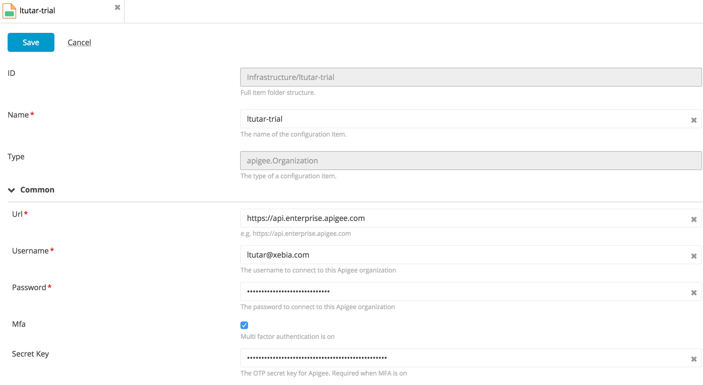
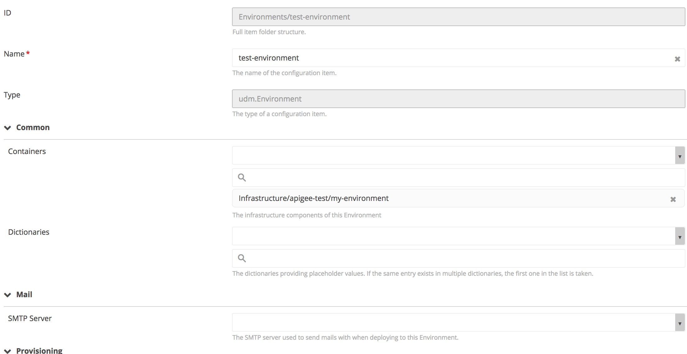
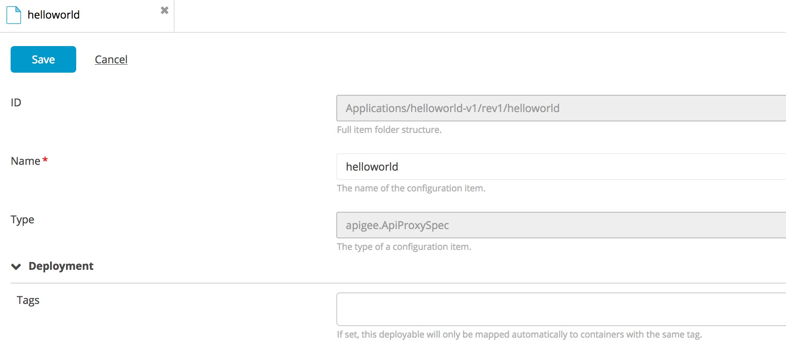
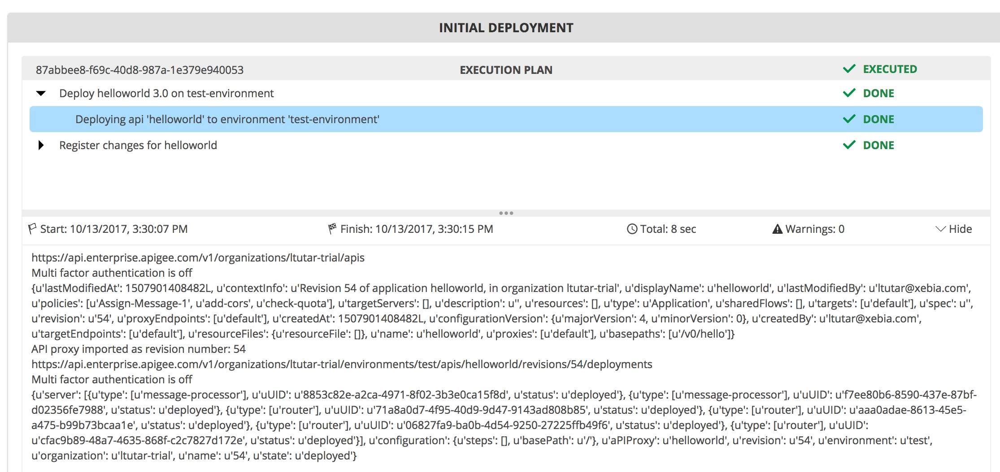

# Preface #

This document describes the functionality provided by the Apigee plugin.

See the **XL Deploy Reference Manual** for background information on XL Deploy and deployment concepts.

# Overview #

The Apigee plugin is a XL Deploy plugin that adds capability for deploying applications to an Apigee environment within an Apigee Organization.

# CI status #

[![Build Status][xld-apigee-plugin-travis-image] ][xld-apigee-plugin-travis-url]
[![Codacy Badge][xld-apigee-plugin-codacy-image] ][xld-apigee-plugin-codacy-url]
[![Code Climate][xld-apigee-plugin-code-climate-image] ][xld-apigee-plugin-code-climate-url]
[![License: MIT][xld-apigee-plugin-license-image] ][xld-apigee-plugin-license-url]
[![Github All Releases][xld-apigee-plugin-downloads-image] ]()

[xld-apigee-plugin-travis-image]: https://travis-ci.org/xebialabs-community/xld-apigee-plugin.svg?branch=master
[xld-apigee-plugin-travis-url]: https://travis-ci.org/xebialabs-community/xld-apigee-plugin
[xld-apigee-plugin-codacy-image]: https://api.codacy.com/project/badge/Grade/db7f22096a014ff0974def7351b21d73    
[xld-apigee-plugin-codacy-url]: https://www.codacy.com/app/ltutar/xld-apigee-plugin
[xld-apigee-plugin-code-climate-image]: https://codeclimate.com/github/ltutar/xld-apigee-plugin/badges/gpa.svg
[xld-apigee-plugin-code-climate-url]: https://codeclimate.com/github/ltutar/xld-apigee-plugin
[xld-apigee-plugin-license-image]: https://img.shields.io/badge/License-MIT-yellow.svg
[xld-apigee-plugin-license-url]: https://opensource.org/licenses/MIT
[xld-apigee-plugin-downloads-image]: https://img.shields.io/github/downloads/xebialabs-community/xld-apigee-plugin/total.svg

# Requirements #

* **Requirements**
	* **XL Deploy** 7.0.1+

# Installation #

Place the plugin JAR file into your `SERVER_HOME/plugins` directory. 

# Usage #

1. Go to `Repository - Infrastructure`, create a new `apigee.Organization` with the Apigee organization as name i.e. ltutar-trial.
2. Go to `Repository - Infrastructure - <Apigee Organization>`, create a new `apigee.Environment` with the Apigee environment as name i.e. prod.
3. Repeat the previous step for all the Apigee environments that belong to this Apigee organization.
3. Create an environment under `Repository - Environments` and add the corresponding `<Apigee Environment>` as container.
4. Create an deployment package `udm.DeploymentPackage` with `apigee.ApiProxySpec` as deployables. The deployment package name should start with `rev<revision number>` i.e. rev1 or `<revision number>` i.e. 1. The deployable name should be the same as the Apigee Proxy name i.e. oauth.
5. Start deploying

# Types #
+ `apigee.Organization`
+ `apigee.Environment`
+ `apigee.ApiProxy`
+ `apigee.ApiProxySpec`

